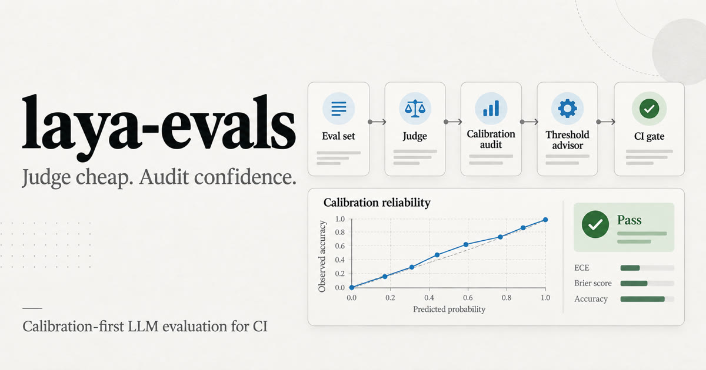
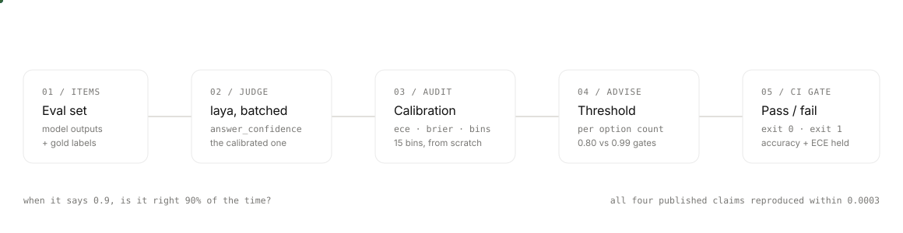

<p align="center">
  
</p>

<h1 align="center">laya-evals</h1>

<p align="center"><strong>Judge cheap. Audit confidence.</strong></p>

<p align="center">
  Calibration-first evaluation for <a href="https://github.com/NandhaKishorM/laya">laya</a>: score eval sets with a local System 1 decision model, verify whether its confidence is reliable, and protect CI from regressions.
</p>

<p align="center">
  <a href="https://github.com/Gjusev/laya-evals/actions/workflows/ci.yml"></a>
  
  <a href="LICENSE"></a>
</p>

<p align="center">
  <a href="#quick-start">Quick start</a> · <a href="#what-you-get">What you get</a> · <a href="#evidence">Measured evidence</a> · <a href="#demo">Demo</a>
</p>



> **Early-development community tool.** This is not the `laya-evals` CLI distributed with the upstream `laya` package. It is an independent, Apache-2.0 project built to make automated evaluation more honest.

## The problem

An answer confidence is only safe to automate on if it has been calibrated against gold labels. That meaning can change with the question shape: in our measured runs, a 3-option XNLI question reached a 90% target at a **0.8074** gate, while a 20-option MASSIVE question needed **0.9944**. One global `min_confidence` is not a policy.

`laya-evals` couples a cheap, batched rubric judge with the evidence needed to decide when to trust it.

<p align="center">
  
</p>

## What you get

| Capability | Why it matters |
| --- | --- |
| **Batched rubric judge** | Ask `choice`, ordered `score`, and boolean `noul` questions in one laya pass. |
| **Calibration audit** | Compute ECE, Brier score, reliability bins, and coverage/accuracy curves from `(confidence, outcome)` pairs. |
| **Threshold advisor** | Select the lowest gate that meets a target accuracy, separately for each question shape. |
| **Judge comparison** | Compare against gold or another judge with agreement, Cohen’s kappa, weighted kappa, accuracy, and cost-per-1k fields. |
| **CI regression gate** | Fail builds when accuracy drops or calibration worsens; deliberately exclude unstable wall-clock measurements. |

## Scope and current status

- **Implemented:** calibration core, threshold advice, batched rubric judging, judge-comparison metrics, reproduction pack, and a reusable regression-gate Action.
- **Measured, not guessed:** the SST-2 laya run and the four reproduction claims below. A public reference-LLM comparison is intentionally still pending; its agreement and cost fields are `null` until a real run is recorded.
- **Use the right confidence:** thresholds are shaped by option count. The audit is specifically designed to prevent a value that worked for one question type from silently governing another.
- **Known upstream caveat:** the laya checkpoint reports invalid temperature buckets for `choice:11+`; the SST-2 measurement uses two options and is outside that bucket.

## Quick start

Requires Python 3.10+ and [uv](https://docs.astral.sh/uv/).

```bash
git clone https://github.com/Gjusev/laya-evals.git
cd laya-evals
uv venv
uv pip install -e ".[dev]"
pytest
```

Start by turning known outcomes into calibration metrics:

```python
from laya_evals import brier_score, coverage_accuracy_curve, ece, reliability_bins

confidences = [0.90, 0.90, 0.90, 0.20]
outcomes = [True, True, True, False]  # prediction == gold

print(ece(confidences, outcomes))
print(brier_score(confidences, outcomes))
print(reliability_bins(confidences, outcomes))
print(coverage_accuracy_curve(confidences, outcomes))
```

For laya decisions, use `answer_confidence`—the model’s declared probability that the answer is correct. `Judge` accepts a laya `Agent` (or compatible object), runs a rubric over a batch, and returns judgments with that confidence attached.

```python
from laya_evals import Judge, confidence_outcome_pairs, ece

judge = Judge(laya_agent, min_confidence=0.8)
questions = {
    "relevance": {
        "type": "choice",
        "instructions": "Is the answer relevant to the question?",
        "criteria": {
            "relevant": "It addresses the question.",
            "irrelevant": "It does not.",
        },
    },
}

judged = judge.judge_batch(model_outputs, questions)
confidences, outcomes = confidence_outcome_pairs(
    [item["relevance"] for item in judged], gold_relevance
)
print(ece(confidences, outcomes))
```

## Evidence

### Independent reproduction pack

We re-ran four public `laya` benchmark claims using the upstream notebook’s protocol: seed 13, 20-option MASSIVE draws, the first 300 test rows per language, pinned checkpoints, and CPU inference on one machine. All four results were within **0.0003** of the published values.

| Claim | Published | Measured | Result |
| --- | ---: | ---: | --- |
| MASSIVE intent, English | 0.7830 | **0.7833** | Reproduces |
| MASSIVE intent, 13 other languages | 0.4510 | **0.4510** | Reproduces |
| XNLI, English | 0.8600 | **0.8600** | Reproduces |
| XNLI, 14 other languages | 0.7310 | **0.7307** | Reproduces |

The recorded [reproduction artifact](results/reproduction.json) includes per-language detail, ECE, top-1 Brier score, protocol, and the ±0.05 verdict rule. Re-run it with:

```bash
uv run --extra compare python scripts/reproduction_pack.py --per-lang 300
```

### SST-2 judge measurement

One measured CPU run on the balanced 872-item SST-2 development split, using laya 0.3.21 and `convaiinnovations/laya` with a two-option sentiment rubric:

| Metric | Measured |
| --- | ---: |
| Accuracy against gold | **0.8968** |
| Cohen’s kappa | **0.7938** |
| ECE, 15 bins | **0.0253** |
| Brier score | **0.0779** |
| Throughput | **6.4 decisions/s** |

The reference LLM judge has not been run, so its agreement and cost fields remain `null` rather than estimated. Full inputs and outputs are in [results/sst2-comparison.json](results/sst2-comparison.json).

```bash
uv run --extra compare python scripts/sst2_judge_comparison.py
uv run --extra compare --extra dev pytest -m slow  # real-checkpoint smoke test
```

## Choose thresholds per shape

`advise_thresholds` finds the lowest confidence gate whose retained examples meet your target accuracy. If no gate can meet it, it returns the best available point and marks the advice as unachievable—never an invented threshold.

| Measured question shape | Target accuracy | Suggested gate | Coverage |
| --- | ---: | ---: | ---: |
| SST-2 · 2 options | 0.95 | 0.8651 | 0.834 |
| XNLI English · 3 options | 0.90 | 0.8074 | 0.893 |
| MASSIVE intent English · 20 options | 0.90 | 0.9944 | 0.773 |

```python
from laya_evals import advise_thresholds

advice = advise_thresholds(
    {
        "options=2": (confidences_2, outcomes_2),
        "options=20": (confidences_20, outcomes_20),
    },
    target_accuracy=0.90,
)
```

## CI regression gate

Compare a fresh measurement with a committed baseline. Accuracy-like metrics fail on drops; calibration metrics fail on rises. The command exits `0` for pass, `1` for regression, and `2` for invalid usage.

```bash
uv run python scripts/check_regression.py \
  --current results/sst2-comparison.json \
  --baseline results/baselines/sst2-comparison.json \
  --metric accuracy_vs_gold:max \
  --metric ece_15_bins:min
```

The reusable GitHub Action lives at [`.github/actions/regression-gate`](.github/actions/regression-gate/action.yml). It is designed for a manual benchmark run because checkpoints are large and CPU evaluation takes minutes.

## Demo

<video controls muted playsinline preload="metadata" poster="docs/assets/social-preview.jpg" width="100%">
  <source src="docs/brag.mp4" type="video/mp4">
  Your browser does not support embedded video. <a href="docs/brag.mp4">Watch the 21-second demo</a>.
</video>

**21 seconds:** from a real benchmark reproduction to the threshold-calibration finding. If your README renderer does not support video, use [the direct MP4 link](docs/brag.mp4) or open the [one-page visual overview](docs/index.html).

## Further reading

- [Interactive visual overview](docs/index.html)
- [Research notebook](research/laya_benchmark_colab.ipynb)
- [Reproduction results](results/reproduction.json)
- [SST-2 judge results](results/sst2-comparison.json)

## License

Apache-2.0. See [LICENSE](LICENSE).
